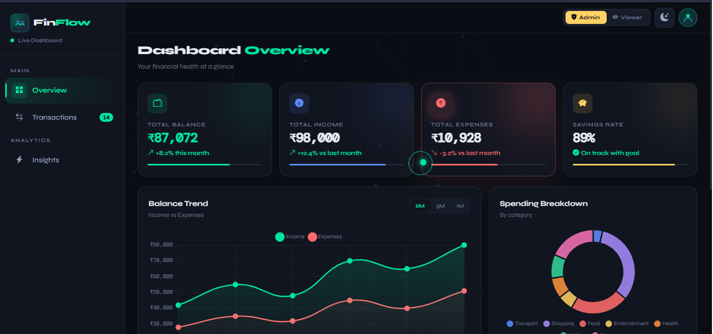
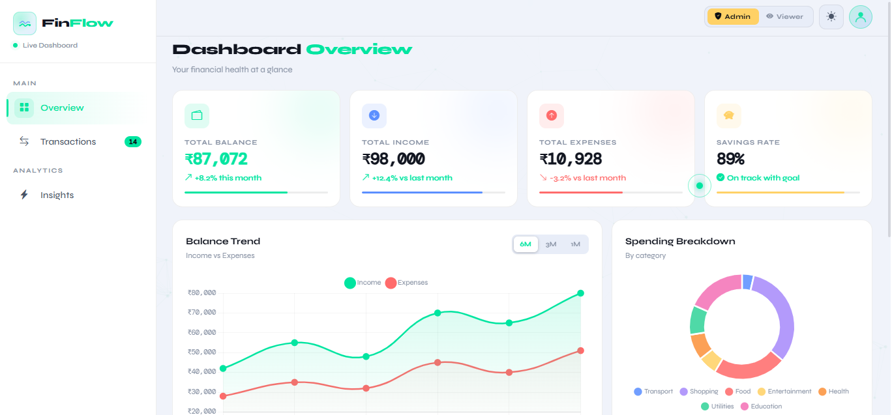
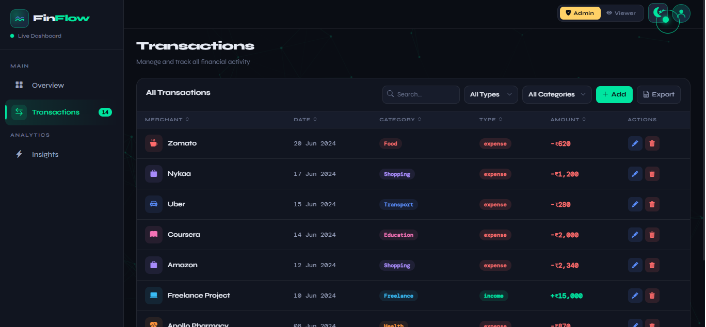
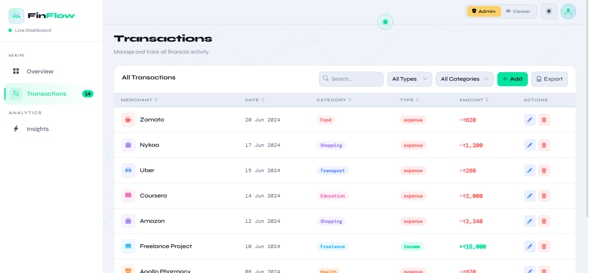
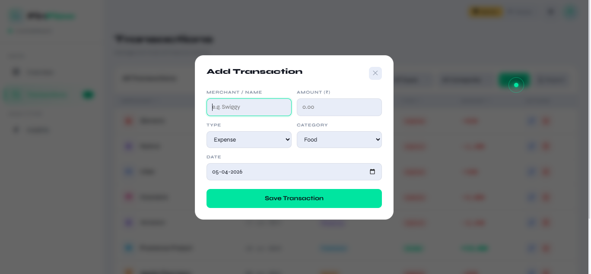
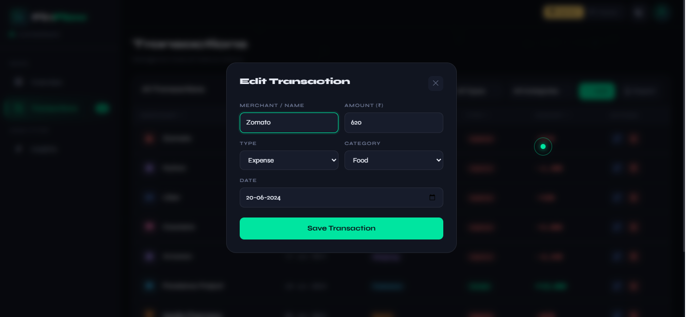
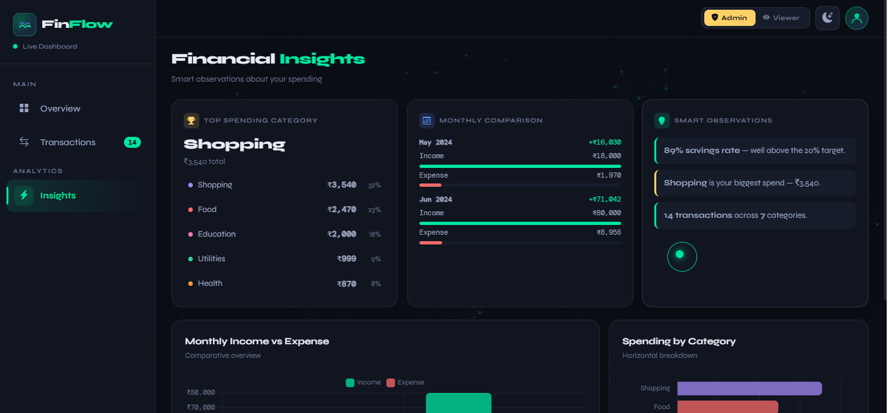
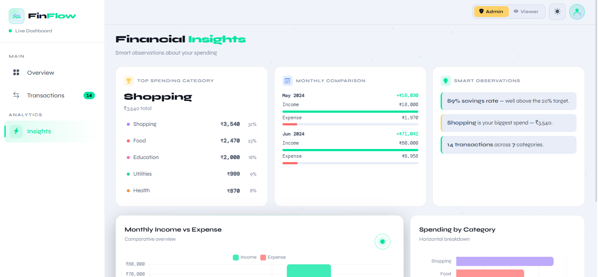
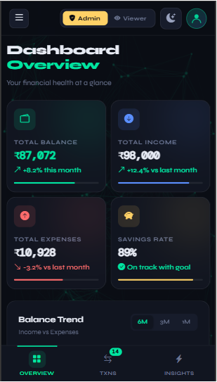

# FinFlow — Finance Dashboard UI

A clean, interactive finance dashboard built as part of the Zorvyn Frontend Developer Intern assessment. FinFlow lets users track income, expenses, and spending patterns through an intuitive, animated interface — all powered by vanilla HTML, CSS, and JavaScript with no build tools required.

---

## Screenshots

### Dashboard — Dark Mode


### Dashboard — Light Mode


### Transactions



### Add Transaction


### Edit Transaction


### Insights — Dark Mode


### Insights — Light Mode


### Mobile View


---

## Setup Instructions

### Open Directly
1. Download or clone this repository
2. Open `index.html` in your browser

### Requirements
- Any modern browser (Chrome, Firefox, Edge, Safari)
- No npm install, no build step, no dependencies to download

---

## Project Structure

```
finflow/
├── index.html        # Entire application (single file)
├── demo/             # Screenshots and demo video
│   ├── dashboard-dark.png
│   ├── dashboard-light.png
│   ├── transaction-dark.png
│   ├── transaction-light.png
│   ├── add-transaction.png
│   ├── edit-transction.png
│   ├── insights-dark.png
│   ├── insights-light.png
│   ├── mobile.png
│   └── sample.mp4
└── README.md         # This file
```

The project is intentionally a single HTML file to keep setup friction at zero while still demonstrating component thinking, state management, and design quality.

---

## Features Overview

### Dashboard Overview
- Summary cards showing **Total Balance**, **Total Income**, **Total Expenses**, and **Savings Rate**
- Animated count-up numbers on load
- Mini progress bars per card
- **Balance Trend** line chart with Income vs Expenses (toggle between 6M / 3M / 1M views)
- **Spending Breakdown** donut chart by category
- Recent transactions preview (latest 5)

### Transactions Section
- Full paginated transactions table (8 per page)
- **Search** by merchant name or category
- **Filter by Type** (Income / Expense) via custom animated dropdown
- **Filter by Category** (9 categories) via custom animated dropdown
- **Column sorting** — click any column header to sort ascending/descending
- **Add / Edit / Delete** transactions (Admin role only)
- **CSV Export** of all transactions
- Row slide-in animations on render, slide-out on delete

### Role-Based UI
- **Admin** — full access: can add, edit, and delete transactions
- **Viewer** — read-only: action buttons hidden, Add button hidden
- Switch roles using the toggle in the top bar — no page reload needed
- Role state affects avatar color and all relevant UI elements instantly

### Insights Section
- **Top Spending Category** with ranked category list and percentages
- **Monthly Comparison** — animated bar breakdown per month (income vs expense, net shown)
- **Smart Observations** — contextual tips based on savings rate and top spend
- **Monthly Income vs Expense** grouped bar chart
- **Spending by Category** horizontal bar chart

### State Management
All state is managed in plain JavaScript with clear separation:
- `txs` — transactions array (persisted to `localStorage`)
- `role` — current user role (`admin` / `viewer`)
- `pg`, `sk`, `sd` — pagination page, sort key, sort direction
- Filter state tied to hidden native `<select>` elements, synced from custom dropdowns
- Charts destroyed and rebuilt on data change or theme toggle to avoid canvas leaks

### UI / UX Details
- **Dark / Light mode** toggle with smooth transition
- **Custom animated cursor** with spark trail effect
- **Animated network background** (canvas-based particle mesh)
- **Responsive layout** — sidebar collapses to bottom navigation on mobile
- **Toast notifications** for all actions (add, edit, delete, export)
- **Empty state** handling with icon when no transactions match filters
- **Keyboard shortcut** — press `N` to open Add Transaction modal (Admin only), `Escape` to close

### Data Persistence
- All transactions are saved to `localStorage` under key `ff_txs`
- Data survives page refreshes
- Seeded with 15 realistic transactions on first load

---

## Tech Stack

| Layer | Choice | Reason |
|---|---|---|
| Structure | HTML5 | Single-file simplicity |
| Styling | Custom CSS + Bootstrap 5 grid | Full design control, responsive utilities |
| Charts | Chart.js 4 | Lightweight, well-documented |
| Icons | Bootstrap Icons | Consistent icon set |
| Fonts | Syne + DM Mono (Google Fonts) | Strong typographic personality |
| State | Vanilla JS (no framework) | Zero overhead, easy to trace |
| Persistence | localStorage | No backend needed |

---

## Design Decisions

**Single-file approach** — Keeping everything in one HTML file removes all setup friction. The evaluator can open it immediately without any install steps.

**No framework** — Vanilla JS was chosen to demonstrate ability to manage state, DOM, and events without framework abstractions. The code is intentionally structured as if components existed (render functions per section, clear data flow).

**Custom dropdowns over native `<select>`** — Native selects can't be styled consistently. Custom dropdowns with animated menus provide a better UX while still syncing to hidden native selects for reliable value management.

**Chart gradients and animations** — Chart.js default styles look generic. Custom gradient fills, rounded bar corners, and eased entrance animations make the data feel alive rather than static.

**Role switching in topbar** — Placing the role toggle in the persistent topbar makes it obvious and always accessible, which is important for a demo/assessment context where the evaluator needs to verify RBAC behavior easily.

---

## Assumptions Made

- Transaction data is mock/static; no real financial data is used
- Roles are frontend-only — there is no authentication
- The "balance trend" line chart uses static monthly seed data to illustrate the visualization; real balance trend would require historical snapshots
- Currency is INR (₹) throughout

---

## Optional Enhancements Implemented

- Dark mode toggle with theme persistence via `data-theme`
- localStorage data persistence
- CSV export
- Animations and transitions throughout
- Custom cursor with spark effect
- Responsive mobile layout with bottom navigation

---

## Author

**Durga E**
edurga02@gmail.com
